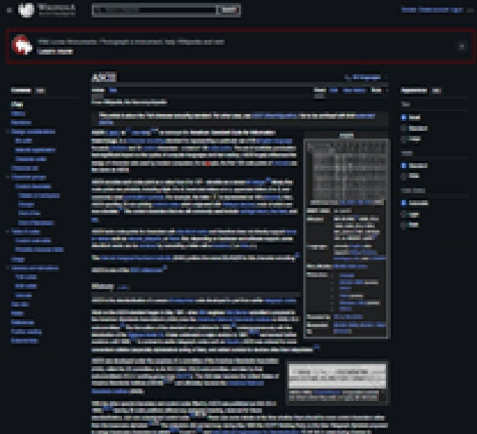
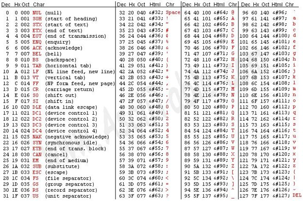

<h2 align="center" >راهنمای استفاده از کدهای ASCII (اسکی) و ANSI (انسی) در رابط‌های کاربری متنی (کنسول‌های متنی)</h2>

<h4 align = "center">تاریخچه</h4>
<p align="justify"; direction="rtl">
ترمینال دستگاهی الکترونیکی یا الکترومکانیکی که می‌توان از آن برای وارد کردن داده به کامپیوتر یا سیستم محاسباتی و دریافت خروجی از آن سیستم‎ها استفاده کرد.
ترمینال‌های قدیمی دستگاه‌های ارزان قیمت بسیار کندی بودند که با پانچ کارت‌ها و نوارهای کاغذی کار می‌کردند. تا این که در سال 1941 کامپیوتر Z3 محصول KONARD ZUSE اولین سیستمی بود که به صفحه کلید مجهز شد. البته این صفحه کلید فقط برای ورود مقادیر عددی بود. در نهایت در سال 1956 مارک 1 اولین کامپیوتری بود که به ترکیب کیبورد و پرینتر مجهز بود. کنسول سیستم، کنسول کامپیوتر، کنسول ریشه یا کنسول کاربری دستگاه ورودی و نمایش سیستم است که شامل یک صفحه کلید، چاپگر یا صفحه نمایش است.
</p>

<h4 align = "center">شبیه ساز ترمینال</h4>
<p align="justify"; direction="rtl">
در روزهای اول عمر کامپیوترها، با ظهور سیستم‌های تعاملی، مدل کلی به صورت یک کامپیوتر محلی متصل به چندین ترمینال بود. این پیکربندی، به نام مدل مین فریم (MAINFRAME) مرکزی معروف بود. شبیه ساز ترمینال یا نرم افزار ترمینال، برنامه کامپیوتری است که یک ترمینال ویدئویی را داخل یک معماری نمایش دیگر شبیه سازی می‌کند. ترمینال معمولاً معادل شل (SHELL) یا ترمینال متنی است که داخل یک رابط کاربری گرافیکی شبیه سازی می‌شود.
ترمینال‌ها از کدهای ترتیبی برای نمایش رنگ، محل مکان نما (CURSOR) و ... استفاده می‌کنند. استانداردهای معروف برای این کدها ECMA-48، ANSI X3.64 و ISO/IEC 6429 می‌باشند.
</p>

<h4>کدهای اسکی، کلید نمایش کاراکترها </h4>
<p align="center"; direction="rtl">اول این که برای اطلاعات بیشتر، اگر دوست داشتید، صفحه ویکی پدیا مربوط به کدهای اسکی را مطالعه کنید.</p>
<h4 align="center">
  <a href="https://en.wikipedia.org/wiki/ASCII">
    </img>
  </a>
</h4>

<p align="justify"; direction="rtl">
برای استفاده از کدهای اسکی، کافیست کلید ALT روی صفحه کلید را نگهداشته و کد مربوط به کاراکتر مورد نظر را وارد کنید. برای مثال ALT + 196 = ─ یا  ALT + 125 = }
</p>
<h4 align="center">جدول ابتدایی اسکی</h4>

<div align="center">
</img>
</div>
<p align="justify" direction="rtl">
توجه کنید که فعلاً برای کاربردهای ابتدایی از کد ردیف DEC یعنی کدهای مبنای 10 استفاده کنید. برنامه زیر به زبان ++c، کدهای قابل چاپ از جدول بالا را نشان می‌دهد.
</p>

```
#include <iostream>
 int main()
{
    std::cout << "Printable ASCII [32..126]:\n";
    for (char c{' '}; c <= '~'; ++c)
        std::cout << c << ((c + 1) % 32 ? ' ' : '\n');
    std::cout << '\n';
}
```
<p align="justify" direction="rtl">
که خروجی این برنامه به صورت زیر خواهد بود.</p>

```
Printable ASCII [32..126]:
  ! " # $ % & ' ( ) * + , - . / 0 1 2 3 4 5 6 7 8 9 : ; < = > ?
@ A B C D E F G H I J K L M N O P Q R S T U V W X Y Z [ \ ] ^ _
` a b c d e f g h i j k l m n o p q r s t u v w x y z { | } ~
```

